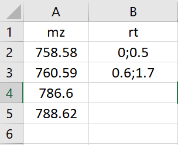

# tools4st

## Overview

tools4st is small tool box. Two functions are currently embeded, **one for drawing MS spectrum and the other for extracting ion intensities**.

## Installation

**Check if R package "devtools" is installed.**
```
# If not, install R package "devtools" first
install.packages("devtools")
```

**Install tools4st**
```
devtools::install_github("Waddlessss/tools4st")
```

**Install MSnbase**
MSnbase is a library to read mzML or mzXML files. Please install it if not.
```
install.packages("MSnbase")
```

## Usage

### Prepare your files

The raw MS data need to be converted in mzML or mzXML format.
- Download MSConvert: https://proteowizard.sourceforge.io/download.html
- Set parameters in MSConvert following instructions: https://ccms-ucsd.github.io/GNPSDocumentation/fileconversion/. See **Data Conversion (Traditional)** section for details. **Important! This setting generates centroid spectra rather than the profile**.
- Convert raw MS data to mzML files.

If you are trying to extract ion intensities, another two-column csv file is needed. The first column contains m/z values of targeted ions, and the second column specifies retention time windows. **The retention time start and end should be separated by semicolon (;) with no space in between**. Here is an example:

  

### Make a plot by averaging MS scans
Now you are ready to make a plot! First, you need to specify the location of your converted raw MS data (mzML or mzXML). This will also be the place of output figures.
```
# Set a working directory
setwd("")
```

Secondly, load this package and make a plot.
```
# Load the package
library(tools4st)
# Plot an averaged MS scan.
drawMS(rawDataName)
```

To see the tunable parameters in this function and other details, run:
```
?drawMS
```

### Extract ion intensities
You can also extract ion intensities by providing a converted raw MS data file (mzML or mzXML) and a csv file (see above). To run this function, their file names are required.
```
# Load the package
library(tools4st)
# Plot an averaged MS scan.
getIntensity(rawDataName, ionTableName)
```

To see the tunable parameters in this function and other details, run:
```
?getIntensity
```

